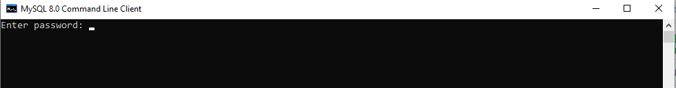
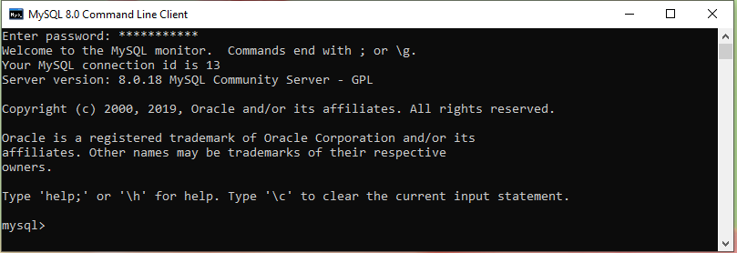
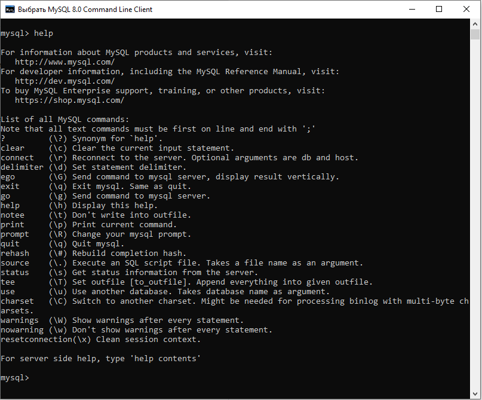

## Практическое задание №4 по дисциплине "Основы построения баз данных", ВШЭКН ЮУрГУ, 2019/2020 учебный год

В ходе выполнения практического задания №4 вы познакомитесь с СУБД MySQL 8.0, научитесь создавать и заполнять базы данных с использованием операторов языка SQL, а также формировать запросы на выборку с использованием оператора SELECT.

## Часть 1

### Задание 1. Установка MySQL 8.0

+ Скачайте установочные файлы на сайте https://dev.mysql.com/downloads/installer/.  
Официальная информация об установке MySQL на Microsoft Windows (на английском языке) находится по адресу: https://dev.mysql.com/doc/refman/8.0/en/windows-installation.html.  
Пошаговая инструкция по установка MySQL 8 на Windows 10 (на русском языке) находится по адресу: 
https://info-comp.ru/install-mysql-on-windows-10.

+ После завершения установки в списке программ появится группа MySQL. Запустите программу MySQL 8.0 Command Line Client или MySQL 8.0 Command Line Client - Unicode:  
  
    
  
  Введите пароль пользователя root, который был задан во время установки MySQL. Диалоговое окно консоли MySQL, которое появится после ввода правильного пароля, должно выглядеть так:  
    
    
    
  Теперь вы можете создавать схемы баз данных, переключаться между ними, создавать таблицы, индексы, писать запросы и т.п.
  
+ Введите команду *help*, чтобы просмотреть список команд MySQL. Обратите внимание, что команды имеют два варианта использования - с помощью ключевого слова и с помощью символа с предшествующей обратной косой чертой (бэкслэш). Все текстовые команды в MySQL должны заканчиваться знаком ;  
  
    

+ Создайте файл, в который будут записываться все ваши команды. которые вы будете вводить в течение выполнения данного практического задания. Этот файл необходимо будет отправить на проверку в зачет первой части практического задания 4. Имя файла должно быть в формате "L4-P1-XXXФамилия.log", где XXX - номер вашей группы, после которого следует ваша фамилия латинскими буквами. Программа автоматически создаст файл с указанным именем. Для того чтобы начать запись в файл, необходимо ввести следующую команду (укажите тот путь, по которому вы хотите сохранить этот файл).  

		mysql> \T C:/Users/Oleg/Documents/GitHub/MySQL_examples/L4-P1-XXXBushuev.log

  Для того чтобы остановить запись в файл, используйте команду
  
  		mysql> \t
  
  Вы можете снова начать запись в уже существующий файл, новые команды будут добавляться к уже существующим.  Для того чтобы избежать проблем с кодировкой при сохранении кириллицы в файл используйте программу MySQL 8.0 Command Line Client - Unicode, то есть вариант консоли со свойствами, установленными для связи через консоль с сервером MySQL с помощью Unicode.

### Задание 2. Создание базы данных

Для создания объектов базы данных используется оператор CREATE. Перед тем, как создать свою первую базу данных "Преподаватели", потренируемся в создании и удалении тестовой базы данных. Убедитесь, что вы включили запись ваших в команд во внешний log-файл.

+ Посмотрите существующие базы данных с помощью следующей команды:

		mysql> SHOW DATABASES;
		
  Теперь создайте тестовую базу данных:
  
  		mysql> CREATE DATABASE testdb;
		
  Посмотрите еще раз список существующих баз данных и убедитесь, что он пополнился базой данных с именем *testdb*.  
  
  Теперь удалите тестовую базу данных:
  
  		mysql> DROP DATABASE testdb;
		
  Посмотрите еще раз список существующих баз данных и убедитесь, что базы данных с именем *testdb* в списке больше нет.
  Операторы CREATE и DROP используются также для создания и удаления других объектов баз данных - таблиц, пользователей и др.

+ Создайте новую базу данных PrepodavateliXX, где XX – номер варианта студента. Переключитесь на нее с помощью команды USE

  		mysql> CREATE DATABASE PrepodavateliXX;	-- создаем базу данных "PrepodavateliXX"
		Query OK, 1 row affected (0.01 sec)
		
		mysql> USE PrepodavateliXX; 		 	-- выбираем базу данных "PrepodavateliXX" для работы с ней
		Database changed

  Двойной дефис "--" используется в SQL для комментариев, то есть обозначения текста, который игнорируется при выполнении команд. Для комментариев, которые занимают несколько строк, используются символы /\* и \*/, которые обозначают начало и конец комментария, соответственно. 
  
+ Создайте новую таблицу Lecturers в базе данных PrepodavateliXX

		/* создадим таблицу Lecturers, которая будет содержать данные преподавателей */
		mysql> CREATE TABLE Lecturers(
			LecturerID INTEGER AUTO_INCREMENT UNIQUE, 
			LastName VARCHAR(15) NOT NULL, 
			FirstName VARCHAR(15) NOT NULL, 
			MiddleName VARCHAR(15),  
			BirthDate DATE, 
			Position VARCHAR(9) NOT NULL, 
			Course VARCHAR(255) NOT NULL, 
			PhoneNumber CHAR(11)
			);
		Query OK, 0 rows affected (0.04 sec)

  После ключевых слов CREATE TABLE пишется имя таблицы и в круглых скобках указываются имена столбцов создаваемой таблицы, после имени стобца указывается тип данных. Подробнее о типах данных в MySQL можно прочитать в официальной документации https://dev.mysql.com/doc/refman/8.0/en/data-types.html. Также при создании таблицы могут быть указаны некоторые особенности столбцов, например, может быть задана автоматическая нумерация для числовых типов данных (AUTO_INCREMENT), указано, что значения в данном столбце должны быть уникальными, то есть не могут повторяться (UNIQUE), или что они не могут содержать пустых ячеек (NOT NULL).
  
  Таблицы в базе данных можно посмотреть с помощью выражения SHOW:
  
  		mysql> SHOW TABLES;
		+---------------------------+
		| Tables_in_prepodavatelixx |
		+---------------------------+
		| lecturers                 |
		+---------------------------+
		1 row in set (0.00 sec)
		
  Схему таблицы можно увидеть с помощью выражения DESCRIBE:
  
  		mysql> DESCRIBE lecturers;
		+-------------+--------------+------+-----+---------+----------------+
		| Field       | Type         | Null | Key | Default | Extra          |
		+-------------+--------------+------+-----+---------+----------------+
		| LecturerID  | int(11)      | NO   | PRI | NULL    | auto_increment |
		| LastName    | varchar(15)  | NO   |     | NULL    |                |
		| FirstName   | varchar(15)  | NO   |     | NULL    |                |
		| MiddleName  | varchar(15)  | YES  |     | NULL    |                |
		| BirthDate   | date         | YES  |     | NULL    |                |
		| Position    | varchar(9)   | NO   |     | NULL    |                |
		| Course      | varchar(255) | NO   |     | NULL    |                |
		| PhoneNumber | char(11)     | YES  |     | NULL    |                |
		+-------------+--------------+------+-----+---------+----------------+
		8 rows in set (0.00 sec)
  
+ Теперь изучим, как вносить изменения в созданную таблицу. Добавьте в таблицу Lecturers новый столбец для стажа преподавателя с помощью оператора ALTER

		mysql> ALTER TABLE Lecturers ADD ServiceLength INTEGER;
		Query OK, 0 rows affected (0.02 sec)
		Records: 0  Duplicates: 0  Warnings: 0

  Проверим добавление столбца с помощью уже известной команды
  
  		mysql> DESCRIBE lecturers;
		+---------------+--------------+------+-----+---------+----------------+
		| Field         | Type         | Null | Key | Default | Extra          |
		+---------------+--------------+------+-----+---------+----------------+
		| LecturerID    | int(11)      | NO   | PRI | NULL    | auto_increment |
		| LastName      | varchar(15)  | NO   |     | NULL    |                |
		| FirstName     | varchar(15)  | NO   |     | NULL    |                |
		| MiddleName    | varchar(15)  | YES  |     | NULL    |                |
		| BirthDate     | date         | YES  |     | NULL    |                |
		| Position      | varchar(9)   | NO   |     | NULL    |                |
		| Course        | varchar(255) | NO   |     | NULL    |                |
		| PhoneNumber   | char(11)     | YES  |     | NULL    |                |
		| ServiceLength | int(11)      | YES  |     | NULL    |                |
		+---------------+--------------+------+-----+---------+----------------+
		9 rows in set (0.00 sec)

  Как вы можете видеть, в список полей (столбцов) таблицы Lecturers добавился новый столбец с именем ServiceLength.  
  
  Добавим ограничение в таблицу Lecturers: поле Position (Должность) может принимать только три значения - 'Профессор', 'Доцент' или 'Ассистент'.
  
  		mysql> ALTER TABLE Lecturers ADD CONSTRAINT CHK_Pos CHECK (Position IN ('Профессор', 'Доцент', 
		'Ассистент'));
		Query OK, 0 rows affected (0.04 sec)
		Records: 0  Duplicates: 0  Warnings: 0

  В данном примере для ограничения множества значений был использован предикат IN. Другим способом ограничить значения поля Position является использование логических операторов.
  
		/* ALTER TABLE Lecturers ADD CONSTRAINT CHK_Pos CHECK (Position='Профессор' OR Position='Доцент' 
		OR Position='Ассистент'); */

  Добавим значение по умолчанию для поля Position
  
  		mysql> ALTER TABLE Lecturers ALTER Position SET DEFAULT 'Доцент';
		Query OK, 0 rows affected (0.01 sec)
		Records: 0  Duplicates: 0  Warnings: 0
		
  Данные ограничения можно было задать при создании таблицы Lecturers 
  
		/* CREATE TABLE Lecturers(
			LecturerID INTEGER AUTO_INCREMENT UNIQUE, 
			LastName VARCHAR(15) NOT NULL, 
			FirstName VARCHAR(15) NOT NULL, 
			MiddleName VARCHAR(15),  
			BirthDate DATE, 
			Position VARCHAR(9) NOT NULL DEFAULT 'Доцент', CHECK (Position IN ('Профессор', 'Доцент', 'Ассистент')), 
			Course VARCHAR(255) NOT NULL, 
			PhoneNumber CHAR(11), 
			ServiceLength INTEGER
			); */
  
  После внесения изменений в таблицу еще раз просмотрите ее схему с помощью выражения DESCRIBE.
  
### Задание 3. Заполнение базы данных

+ Заполним таблицу Lecturers. Ниже приведены примеры заполнения таблицы, вам необходимо заполнить ее своими данными из первой практической работы. Для добавления записей в таблицу используется оператор INSERT. Сначала внесем в таблицу одну запись, причем воспользуемся тем, что в поле LecturerID установлена автонумерация.

		mysql> INSERT INTO Lecturers
				(LastName, FirstName, MiddleName, BirthDate, Position, Course, PhoneNumber, ServiceLength) 	
			      VALUES 
				('Иванов', 'Иван', 'Иванович', "1986-05-12", 'Ассистент', 'Математика', '89123943022', 4);
		Query OK, 1 row affected (0.01 sec)

  Добавим еще одну запись, воспользуемся тем, что в поле Position установлено значение по умолчанию 'Доцент'
  
  		mysql> INSERT INTO Lecturers
				(LastName, FirstName, MiddleName, BirthDate, Course, PhoneNumber, ServiceLength) 	
			      VALUES 
				('Петров', 'Петр', 'Петрович', "1959-04-02", 'Математика', '89189200988', 30);
		Query OK, 1 row affected (0.01 sec)

  С помощью данной команды можно одновременно вносить данные для нескольких записей.
  
  		mysql> INSERT INTO Lecturers
				(LastName, FirstName, MiddleName, BirthDate, Position, Course, PhoneNumber, ServiceLength)	
			      VALUES 
				('Андреев', 'Андрей', 'Андреевич', "1972-01-23", 'Профессор', 'Физика', '89327539732', 22),
				('Васильев', 'Василий', 'Васильевич', "1983-04-01", 'Доцент', 'Физика', '89327539732', 12),
				('Михайлов', 'Михаил', 'Михайлович', "1971-11-08", 'Профессор', 'Информатика', '89738925451', 19), 
				('Сергеев', 'Сергей', 'Сергеевич', "1991-02-17", 'Ассистент', 'Информатика', '89832083342', 4);
		Query OK, 4 rows affected (0.00 sec)
		Records: 4  Duplicates: 0  Warnings: 0

  Аналогично вышеуказанным примерам, заполните вашу таблицу своими данными, которые вы использовали при выполнении первого практического задания. При заполнении таблицы проверьте реакцию системы на ввод неправильных данных, например попробуйте для поля Position указать значение 'Лаборант'.

### Задание 4. Формирование запросов с использованием оператора SELECT  

+ Просмотрите все записи созданной вами таблицы с помощью оператора SELECT.

		mysql> SELECT * FROM Lecturers;
		+------------+----------+-----------+------------+------------+-----------+-------------+-------------+---------------+
		| LecturerID | LastName | FirstName | MiddleName | BirthDate  | Position  | Course      | PhoneNumber | ServiceLength |
		+------------+----------+-----------+------------+------------+-----------+-------------+-------------+---------------+
		|          1 | Иванов   | Иван      | Иванович   | 1986-05-12 | Ассистент | Математика  | 89123943022 |             4 |
		|          2 | Петров   | Петр      | Петрович   | 1959-04-02 | Доцент    | Математика  | 89189200988 |            30 |
		|          3 | Андреев  | Андрей    | Андреевич  | 1972-01-23 | Профессор | Физика      | 89327539732 |            22 |
		|          4 | Васильев | Василий   | Васильевич | 1983-04-01 | Доцент    | Физика      | 89327539732 |            12 |
		|          5 | Михайлов | Михаил    | Михайлович | 1971-11-08 | Профессор | Информатика | 89738925451 |            19 |
		|          6 | Сергеев  | Сергей    | Сергеевич  | 1991-02-17 | Ассистент | Информатика | 89832083342 |             4 |
		+------------+----------+-----------+------------+------------+-----------+-------------+-------------+---------------+
		6 rows in set (0.00 sec)

  Проведите сортировку записей по полю BirthDate (дата рождения) по убыванию с помощью выражений ORDER BY и DESC.
  
  		mysql> SELECT * FROM Lecturers ORDER BY BirthDate DESC;
		+------------+----------+-----------+------------+------------+-----------+-------------+-------------+---------------+
		| LecturerID | LastName | FirstName | MiddleName | BirthDate  | Position  | Course      | PhoneNumber | ServiceLength |
		+------------+----------+-----------+------------+------------+-----------+-------------+-------------+---------------+
		|          6 | Сергеев  | Сергей    | Сергеевич  | 1991-02-17 | Ассистент | Информатика | 89832083342 |             4 |
		|          1 | Иванов   | Иван      | Иванович   | 1986-05-12 | Ассистент | Математика  | 89123943022 |             4 |
		|          4 | Васильев | Василий   | Васильевич | 1983-04-01 | Доцент    | Физика      | 89327539732 |            12 |
		|          3 | Андреев  | Андрей    | Андреевич  | 1972-01-23 | Профессор | Физика      | 89327539732 |            22 |
		|          5 | Михайлов | Михаил    | Михайлович | 1971-11-08 | Профессор | Информатика | 89738925451 |            19 |
		|          2 | Петров   | Петр      | Петрович   | 1959-04-02 | Доцент    | Математика  | 89189200988 |            30 |
		+------------+----------+-----------+------------+------------+-----------+-------------+-------------+---------------+
		6 rows in set (0.00 sec)
  
   Обратите внимание, как MySQL работает с типом данных DATE. Самостоятельно попробуйте провести сортировку по разным полям по убыванию (DESC) и возрастанию (ASC).

+ Попрактикуйтесь в использовании оператора SELECT, опираясь на нижеприведенные примеры.  
  Выбор ФИО и должности преподавателей, сортировка по должностям
  
  		mysql> SELECT LastName, FirstName, MiddleName, Position 
			FROM Lecturers 
			ORDER BY Position;
		+----------+-----------+------------+-----------+
		| LastName | FirstName | MiddleName | Position  |
		+----------+-----------+------------+-----------+
		| Иванов   | Иван      | Иванович   | Ассистент |
		| Сергеев  | Сергей    | Сергеевич  | Ассистент |
		| Петров   | Петр      | Петрович   | Доцент    |
		| Васильев | Василий   | Васильевич | Доцент    |
		| Андреев  | Андрей    | Андреевич  | Профессор |
		| Михайлов | Михаил    | Михайлович | Профессор |
		+----------+-----------+------------+-----------+
		6 rows in set (0.00 sec)
		
  Выбор только доцентов с сортировкой по стажу работы
  
  		mysql> SELECT * 
			FROM Lecturers 
			WHERE Position = 'Доцент' 
			ORDER BY ServiceLength;
		+------------+----------+-----------+------------+------------+----------+------------+-------------+---------------+
		| LecturerID | LastName | FirstName | MiddleName | BirthDate  | Position | Course     | PhoneNumber | ServiceLength |
		+------------+----------+-----------+------------+------------+----------+------------+-------------+---------------+
		|          4 | Васильев | Василий   | Васильевич | 1983-04-01 | Доцент   | Физика     | 89327539732 |            12 |
		|          2 | Петров   | Петр      | Петрович   | 1959-04-02 | Доцент   | Математика | 89189200988 |            30 |
		+------------+----------+-----------+------------+------------+----------+------------+-------------+---------------+
		2 rows in set (0.00 sec)

  Выбор по фамилии с окончанием 'ев'

		mysql> SELECT * 
			FROM Lecturers 
			WHERE LastName LIKE '%ев';
		+------------+----------+-----------+------------+------------+-----------+-------------+-------------+---------------+
		| LecturerID | LastName | FirstName | MiddleName | BirthDate  | Position  | Course      | PhoneNumber | ServiceLength |
		+------------+----------+-----------+------------+------------+-----------+-------------+-------------+---------------+
		|          3 | Андреев  | Андрей    | Андреевич  | 1972-01-23 | Профессор | Физика      | 89327539732 |            22 |
		|          4 | Васильев | Василий   | Васильевич | 1983-04-01 | Доцент    | Физика      | 89327539732 |            12 |
		|          6 | Сергеев  | Сергей    | Сергеевич  | 1991-02-17 | Ассистент | Информатика | 89832083342 |             4 |
		+------------+----------+-----------+------------+------------+-----------+-------------+-------------+---------------+
		3 rows in set (0.00 sec)
		
  Выбор ФИО и должности преподавателей с фамилией, оканчивающейся на 'ов'

		mysql> SELECT LastName, FirstName, MiddleName, Position 
			FROM Lecturers 
			WHERE LastName LIKE '%ов';
		+----------+-----------+------------+-----------+
		| LastName | FirstName | MiddleName | Position  |
		+----------+-----------+------------+-----------+
		| Иванов   | Иван      | Иванович   | Ассистент |
		| Петров   | Петр      | Петрович   | Доцент    |
		| Михайлов | Михаил    | Михайлович | Профессор |
		+----------+-----------+------------+-----------+
		3 rows in set (0.00 sec)
  
  Выбор фамилии и телефона преподавателя
  
  		mysql> SELECT LastName, PhoneNumber 
			FROM Lecturers;
		+----------+-------------+
		| LastName | PhoneNumber |
		+----------+-------------+
		| Иванов   | 89123943022 |
		| Петров   | 89189200988 |
		| Андреев  | 89327539732 |
		| Васильев | 89327539732 |
		| Михайлов | 89738925451 |
		| Сергеев  | 89832083342 |
		+----------+-------------+
		6 rows in set (0.00 sec)
+ Данные в таблице можно изменять при помощи оператора UPDATE. Например, заменим номер телефона у преподавателя с фамилией Сергеев.
		
		mysql> UPDATE Lecturers 
			SET PhoneNumber='89229923450' 
			WHERE LastName='Сергеев';
		Query OK, 1 row affected (0.00 sec)
		Rows matched: 1  Changed: 1  Warnings: 0
			
  Проверим изменение телефона.
 
 		mysql> SELECT LastName, PhoneNumber 
			FROM Lecturers;
		+----------+-------------+
		| LastName | PhoneNumber |
		+----------+-------------+
		| Иванов   | 89123943022 |
		| Петров   | 89189200988 |
		| Андреев  | 89327539732 |
		| Васильев | 89327539732 |
		| Михайлов | 89738925451 |
		| Сергеев  | 89229923450 |
		+----------+-------------+
		6 rows in set (0.00 sec)

+ Завершите запись команд в файл и отправьте ваш файл "L4-P1-XXXФамилия.log" на проверку (в элементе курса "Сдать на проверку Практическое задание 4").
