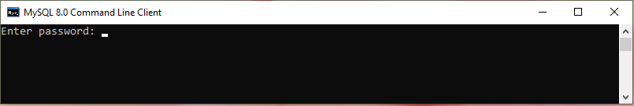

# Практическое задание №4 по дисциплине "Основы построения баз данных", ВШЭКН ЮУрГУ, 2019/2020 ученый год

В ходе выполнения практического задания №4 вы познакомитесь с СУБД MySQL 8.0, научитесь создавать и заполнять базы данных с использованием операторов языка SQL, а также формировать запросы на выборку с использованием оператора SELECT.

## Часть 1

### Задание 1. Установка MySQL 8.0

+ Скачайте установочные файлы на сайте https://dev.mysql.com/downloads/installer/.  
Официальная информация об установке MySQL на Microsoft Windows (на английском языке) находится по адресу: https://dev.mysql.com/doc/refman/8.0/en/windows-installation.html.  
Пошаговая инструкция по установка MySQL 8 на Windows 10 (на русском языке) находится по адресу: 
https://info-comp.ru/install-mysql-on-windows-10.

+ После завершения установки в списке программ появится группа MySQL. Запустите программу MySQL 8.0 Command Line Client:  
  
    
  
  Введите пароль пользователя root, который был задан во время установки MySQL. Диалоговое окно консоли MySQL, которое появится после ввода правильного пароля, должно выглядеть так:  
    
    
    
  Теперь вы можете создавать схемы баз данных, переключаться между ними, создавать таблицы, индексы, писать запросы и т.п.
  
+ Введите команду *help*, чтобы просмотреть список команд MySQL. Обратите внимание, что команды имеют два варианта использования - с помощью ключевого слова и с помощью символа с предшествующей обратной косой чертой (бэкслэш). Команды в MySQL должны заканчиваться знаком ;  
  
    

+ Создайте файл, в который будут записываться все ваши команды. которые вы будете вводить в течение выполнения данного практического задания. Этот файл необходимо будет отправить на проверку в зачет первой части практического задания 4. Имя файла должно быть в формате "L4-P1-XXXФамилия.log", где XXX - номер вашей группы, после которого следует ваша фамилия латинскими буквами. Программа автоматически создаст файл с указанным именем. Для того чтобы начать запись в файл, необходимо ввести следюущую команду (укажите тот путь, по которому вы хотите сохранить этот файл).  

		\T C:/Users/Oleg/Documents/GitHub/MySQL_examples/L1-P1-Bushuev.log

  Для того чтобы остановить запись в файл, используйте команду
  
  		\t
  
  Вы можете снова начать запись в уже существующий файл, новые команды будут добавляться к уже существующим.

### Задание 2. Создание базы данных

Для создания объектов базы данных используется оператор CREATE. Перед тем, как создать свою первую базу данных "Преподаватели", потренируемся в создании и удалении тестовой базы данных. Убедитесь, что вы включили запись ваших в команд во внешний log-файл.

+ Посмотрите существующие базы данных с помощью следующей команды:

		SHOW DATABASES;
		
  Теперь создайте тестовую базу данных:
  
  		CREATE DATABASE testdb;
		
  Посмотрите еще раз список существующих баз данных и убедитесь, что он пополнился базой данных с именем *testdb*.  
  
  Теперь удалите тестовую базу данных:
  
  		DROP DATABASE testdb;
		
  Посмотрите еще раз список существующих баз данных и убедитесь, что базы данных с именем *testdb* в списке больше нет.
  Операторы CREATE и DROP используются также для создания и удаления других объектов баз данных - таблиц, пользователей и др.

+ Создайте новую базу данных PrepodavateliXX, где XX – номер варианта студента. Переключитесь на нее с помощью команды USE

  		CREATE DATABASE PrepodavateliXX;	-- создаем базу данных "PrepodavateliXX"
		USE PrepodavateliXX; 		 	-- выбираем базу данных "PrepodavateliXX" для работы с ней 

  Двойной дефис "--" используется в SQL для комментариев, то есть обозначения текста, который игнорируется при выполнении команд. Для комментариев, которые занимают несколько строк, используются символы /\* и \*/, которые обозначают начало и конец комментария, соответственно. 
  
+ Создайте новую таблицу Lecturers в базе данных PrepodavateliXX

		/* создадим таблицу Lecturers, которая будет содержать данные преподавателей */
		CREATE TABLE Lecturers(
			LecturerID INTEGER AUTO_INCREMENT UNIQUE, 
			LastName VARCHAR(15) NOT NULL, 
			FirstName VARCHAR(15) NOT NULL, 
			MiddleName VARCHAR(15),  
			BirthDate DATE, 
			Position VARCHAR(9) NOT NULL, 
			Course VARCHAR(255) NOT NULL, 
			PhoneNumber CHAR(11)
			);

/* добавим в созданную таблицу Lecturers новое поле для стажа */

ALTER TABLE Lecturers ADD ServiceLength INTEGER;

/* добавим ограничения в таблицу Lecturers */

ALTER TABLE Lecturers ADD CONSTRAINT CHK_Pos CHECK (Position IN ('Профессор', 'Доцент', 'Ассистент'));

-- альтернативный вариант
-- ALTER TABLE Lecturers ADD CONSTRAINT CHK_Pos CHECK (Position='Профессор' OR Position='Доцент' OR Position='Ассистент'); 

ALTER TABLE Lecturers ALTER Position SET DEFAULT 'Доцент';

/* данные ограничения можно было задать при создании таблицы Lecturers */

CREATE TABLE Lecturers (LecturerID INTEGER AUTO_INCREMENT UNIQUE, LastName VARCHAR(15) NOT NULL, FirstName VARCHAR(15) NOT NULL, MiddleName VARCHAR(15),  BirthDate DATE, Position VARCHAR(9) NOT NULL DEFAULT 'Доцент', CHECK (Position IN ('Профессор', 'Доцент', 'Ассистент')), Course VARCHAR(255) NOT NULL, PhoneNumber CHAR(11), ServiceLength INTEGER);

Задание 3. Заполнение базы данных

/* заполним таблицу Lecturers */

--воспользуемся тем, что в поле LecturerID установлена автонумерация
INSERT INTO Lecturers(LastName, FirstName, MiddleName, BirthDate, Position, Course, PhoneNumber, ServiceLength) VALUES('Иванов', 'Иван', 'Иванович', "1986-05-12", 'Ассистент', 'Математика', '89123943022', 4);

--воспользуемся тем, что в поле Position установлено значение по умолчанию 'Доцент'

INSERT INTO Lecturers(LastName, FirstName, MiddleName, BirthDate, Course, PhoneNumber, ServiceLength) VALUES('Петров', 'Петр', 'Петрович', "1959-04-02", 'Математика', '89189200988', 30);

INSERT INTO Lecturers(LastName, FirstName, MiddleName, BirthDate, Position, Course, PhoneNumber, ServiceLength) VALUES('Андреев', 'Андрей', 'Андреевич', "1972-01-23", 'Профессор', 'Физика', '89327539732', 22);

INSERT INTO Lecturers(LastName, FirstName, MiddleName, BirthDate, Position, Course, PhoneNumber, ServiceLength) VALUES('Васильев', 'Василий', 'Васильевич', "1983-04-01", 'Доцент', 'Физика', '89327539732', 12);

INSERT INTO Lecturers(LastName, FirstName, MiddleName, BirthDate, Position, Course, PhoneNumber, ServiceLength) VALUES('Михайлов', 'Михаил', 'Михайлович', "1971-11-08", 'Профессор', 'Информатика', '89738925451', 19);

INSERT INTO Lecturers(LastName, FirstName, MiddleName, BirthDate, Position, Course, PhoneNumber, ServiceLength) VALUES('Сергеев', 'Сергей', 'Сергеевич', "1991-02-17", 'Ассистент', 'Информатика', '89832083342', 4);

/* произведем замену данных */

--Заменим номер телефона у преподавателя с фамилией Сергеев
UPDATE Lecturers SET PhoneNumber='89229923450' WHERE LastName='Сергеев';
 

Задание 4. Формирование запросов с использованием оператора SELECT  

/* построим запросы на выборку данных с сортировкой */

--сортировка всех преподавателей по дате рождения
SELECT * FROM Lecturers ORDER BY BirthDate ASC;

--ФИО и должности преподавателей

SELECT LastName, FirstName, MiddleName, Position FROM Lecturers ORDER BY Position;

-- выбор только доцентов с сортировкой по стажу работы
SELECT * FROM Lecturers WHERE Position='Доцент' ORDER BY ServiceLength;

--выбор по фамилии с окончанием 'ев'

SELECT * FROM Lecturers WHERE LastName LIKE '%ев';

--запрос на выборку с параметром

SELECT LastName, FirstName, MiddleName, Position FROM Lecturers ORDER BY Position;

--

SELECT LastName, FirstName, MiddleName, Position FROM Lecturers WHERE LastName LIKE '%ев';

--

SELECT LastName, FirstName, MiddleName, PhoneNumber FROM Lecturers WHERE LastName LIKE '%ов';

--
SELECT Position, avg(ServiceLength) FROM Lecturers GROUP BY Position;

7. В результате "Отчет о работе №4" надо прикрепить

MySQL Workbench - познакомиться с ним во второй работе

