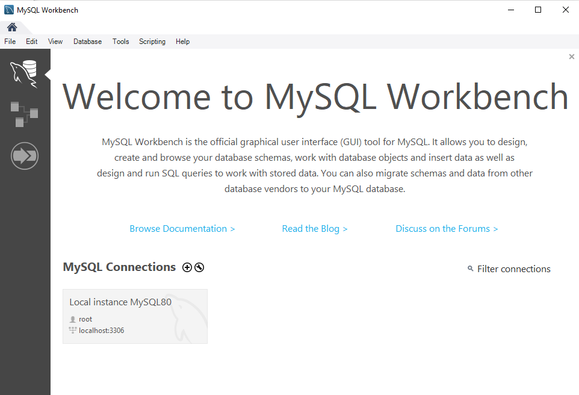
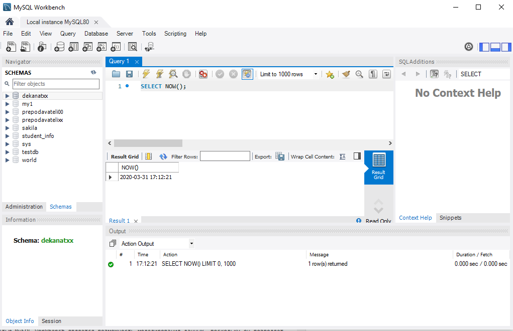
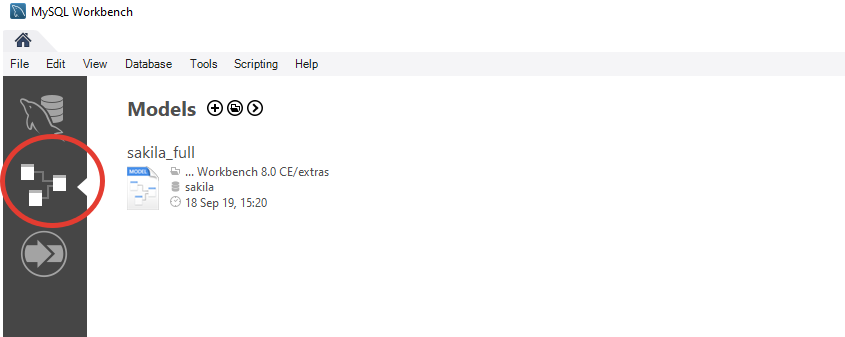
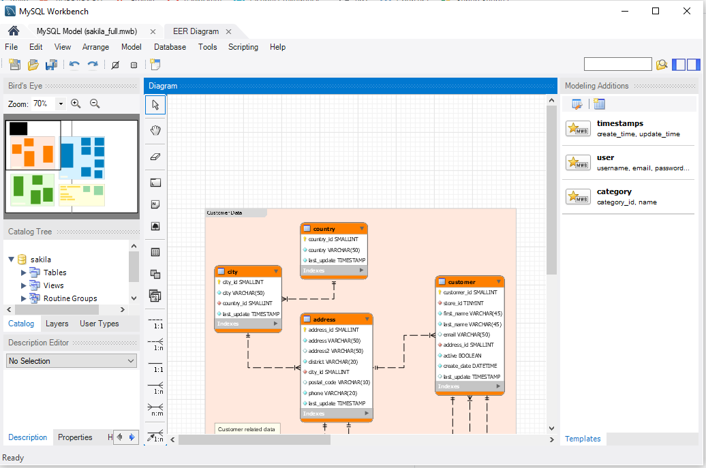
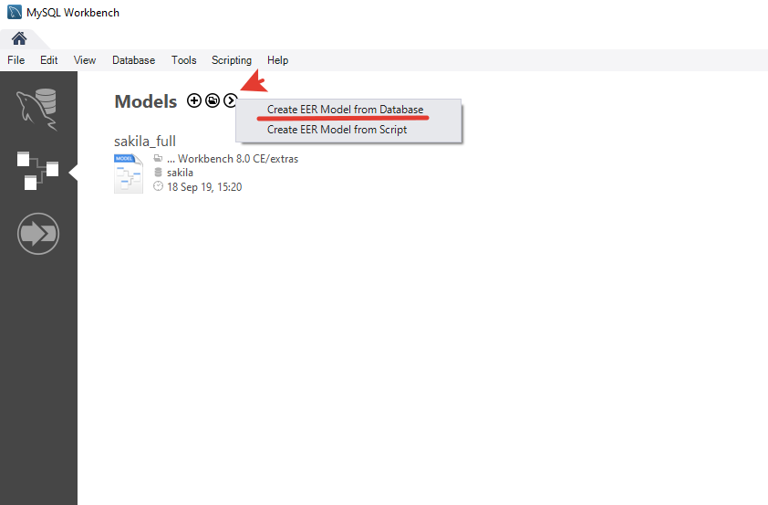
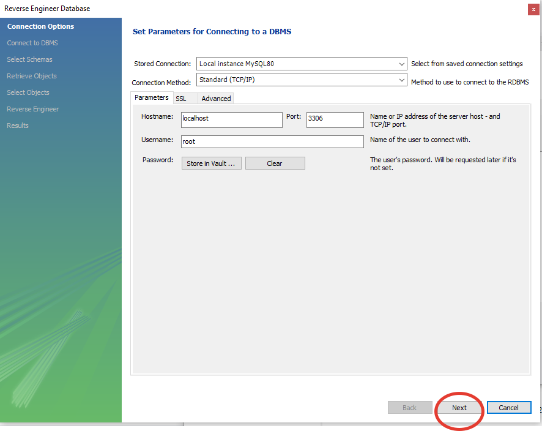
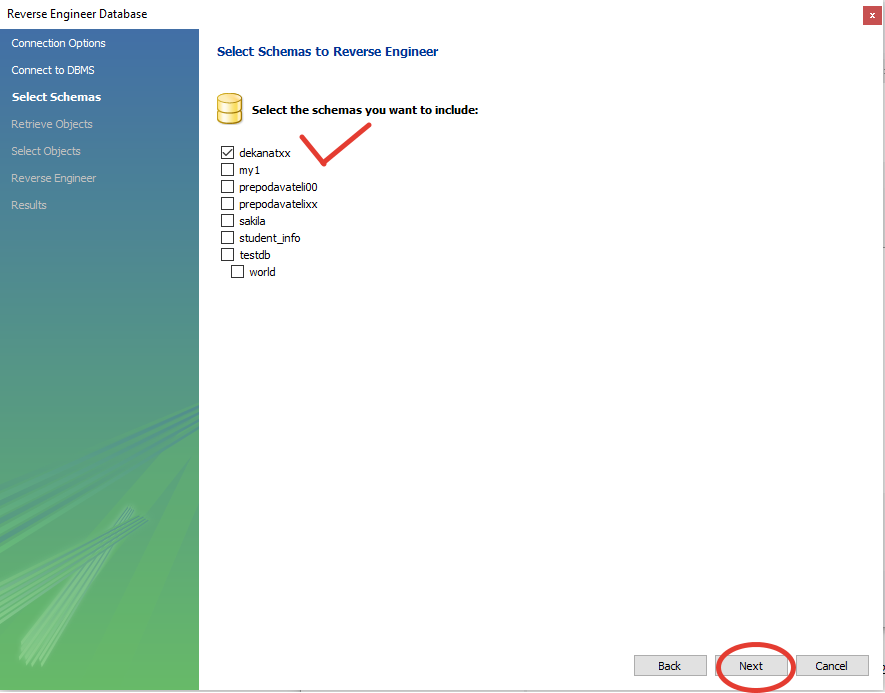
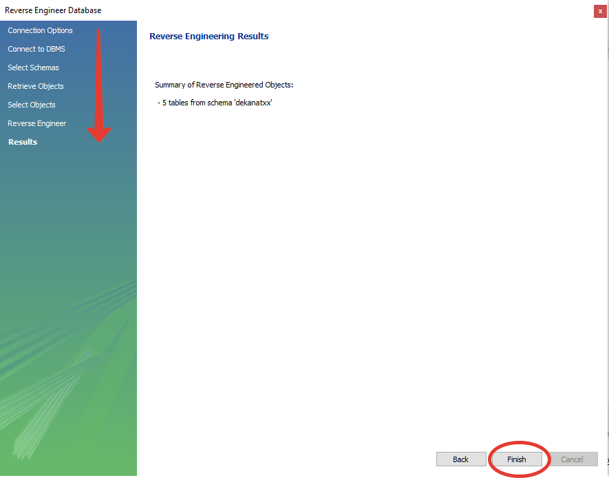
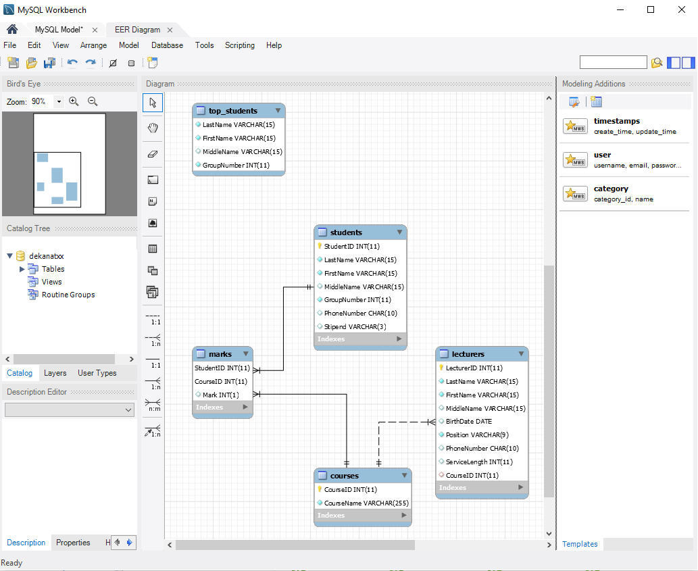

## Практическое задание №4 по дисциплине "Основы построения баз данных", ВШЭКН ЮУрГУ, 2020/2021 учебный год

В ходе выполнения практического задания 4 необходимо опираться на практическое задание 2, в котором вы создавали базу данных Деканат, включающую в себя несколько таблиц. 

### Задание 1. Создание базы данных "Деканат" с использованием языка SQL

+ Перед началом работы создайте файл, в который будут записываться все ваши команды, которые вы будете вводить в течение выполнения данного практического задания. Этот файл необходимо будет отправить для проверки выполнения практического задания 4. Имя файла должно быть в формате "L4-XXXFamilia.log", где XXX - номер вашей группы, после которого следует ваша фамилия латинскими буквами. Программа автоматически создаст файл с указанным именем. Для того чтобы начать запись в файл, необходимо ввести следующую команду (укажите тот путь, по которому вы хотите сохранить этот файл).  

		mysql> \T C:/Users/Oleg/Documents/GitHub/MySQL_examples/L4-XXXBushuev.log

  Для того чтобы остановить запись в файл, используйте команду
  
  		mysql> \t

+ Используйте команду SELECT NOW(); для вывода на экран текущего времени.

+ Создайте новую базу данных DekanatXX, где XX – номер варианта студента. Для создания базы данных используйте выражение CREATE SCHEMA или CREATE DATABASE. Переключитесь на нее с помощью команды USE.

+ Создайте новую таблицу Students, которая будет содержать данные студентов. Определите следующие названия полей и их типы данных:

		+-------------+-------------+------+-----+---------+-------+
		| Field       | Type        | Null | Key | Default | Extra |
		+-------------+-------------+------+-----+---------+-------+
		| StudentID   | int(11)     | NO   | PRI | NULL    |       |
		| LastName    | varchar(15) | NO   |     | NULL    |       |
		| FirstName   | varchar(15) | NO   |     | NULL    |       |
		| MiddleName  | varchar(15) | YES  |     | NULL    |       |
		| GroupNumber | int(11)     | NO   |     | NULL    |       |
		| PhoneNumber | char(10)    | YES  |     | NULL    |       |
		| Stipend     | varchar(3)  | YES  |     | Нет     |       |
		+-------------+-------------+------+-----+---------+-------+
  
  Обратите внимание на поля, значение которых не может быть NULL, а также на ключевое поле. В поле Stipend (стипендия) необходимо добавить значение по умолчанию 'Нет'.
  
+ Создайте новую таблицу Courses, которая будет содержать дисциплины.  Определите следующие названия полей и их типы данных:

		+------------+--------------+------+-----+---------+-------+
		| Field      | Type         | Null | Key | Default | Extra |
		+------------+--------------+------+-----+---------+-------+
		| CourseID   | int(11)      | NO   | PRI | NULL    |       |
		| CourseName | varchar(255) | NO   |     | NULL    |       |
		+------------+--------------+------+-----+---------+-------+

+ Создайте новую таблицу Lecturers, которая будет содержать данные преподавателей. Определите следующие названия полей и их типы данных:

		+---------------+-------------+------+-----+---------+----------------+
		| Field         | Type        | Null | Key | Default | Extra          |
		+---------------+-------------+------+-----+---------+----------------+
		| LecturerID    | int(11)     | NO   | PRI | NULL    | auto_increment |
		| LastName      | varchar(15) | NO   |     | NULL    |                |
		| FirstName     | varchar(15) | NO   |     | NULL    |                |
		| MiddleName    | varchar(15) | YES  |     | NULL    |                |
		| BirthDate     | date        | YES  |     | NULL    |                |
		| Position      | varchar(9)  | NO   |     | NULL    |                |
		| PhoneNumber   | char(10)    | YES  |     | NULL    |                |
		| ServiceLength | int(11)     | YES  |     | NULL    |                |
		| CourseID      | int(11)     | YES  |     | NULL    |                |
		+---------------+-------------+------+-----+---------+----------------+
		
  Вместо того, чтобы написать новую команду для создания таблицы Lecturers, вы можете использовать команду для создания таблицы Lecturers из первой части четвертого практического задания. В этом случае ваша таблица будет иметь поле Course (Дисциплина), который можно удалить, а вместо него добавить новое поле CourseID (КодДисциплины), используя оператор ALTER:
  
  		mysql> ALTER TABLE Lecturers DROP COLUMN Course; 		-- удалить столбец (поле) Course из таблицы Lecturers
		mysql> ALTER TABLE Lecturers ADD CourseID INTEGER NOT NULL;	-- столбец (поле) CourseID в таблицу Lecturers
  
  Если вы захотите поменять местами некоторые столбцы, то можете воспользоваться следующей командой
  
		mysql> ALTER TABLE Lecturers MODIFY CourseID INTEGER AFTER Position;
		Query OK, 0 rows affected (0.07 sec)
		Records: 0  Duplicates: 0  Warnings: 0
		
		mysql> DESC lecturers;
		+---------------+-------------+------+-----+---------+----------------+
		| Field         | Type        | Null | Key | Default | Extra          |
		+---------------+-------------+------+-----+---------+----------------+
		| LecturerID    | int(11)     | NO   | PRI | NULL    | auto_increment |
		| LastName      | varchar(15) | NO   |     | NULL    |                |
		| FirstName     | varchar(15) | NO   |     | NULL    |                |
		| MiddleName    | varchar(15) | YES  |     | NULL    |                |
		| BirthDate     | date        | YES  |     | NULL    |                |
		| Position      | varchar(9)  | NO   |     | NULL    |                |
		| CourseID      | int(11)     | YES  |     | NULL    |                |
		| PhoneNumber   | char(10)    | YES  |     | NULL    |                |
		| ServiceLength | int(11)     | YES  |     | NULL    |                |
		+---------------+-------------+------+-----+---------+----------------+
		9 rows in set (0.00 sec)
  
+ Создайте новую таблицу Marks, которая будет содержать оценки. Определите следующие названия полей и их типы данных:

		+-----------+---------+------+-----+---------+-------+
		| Field     | Type    | Null | Key | Default | Extra |
		+-----------+---------+------+-----+---------+-------+
		| StudentID | int(11) | NO   | PRI | NULL    |       |
		| CourseID  | int(11) | NO   | PRI | NULL    |       |
		| Mark      | int(1)  | YES  |     | NULL    |       |
		+-----------+---------+------+-----+---------+-------+
  
  Обратите внимание, в этой таблице первичным ключом будет не одно, а два поля, поскольку значения в каждом отдельном поле могут повторяться, но для каждого студента по одной дисциплине может быть только одна оценка. Добиться этого можно, указав при создании таблицы выражение PRIMARY KEY(StudentID, CourseID).
  
+ Проверьте структуру созданных таблиц с помощью выражения DESCRIBE.

+ Установите связи между таблицами, задайте каскадное обновление и каскадное удаление связанных записей. В MS Access вы использовали графический интерфейс для редактирования схемы данных. В MySQL для этой цели служит оператор ALTER, который позволяет установить связи между таблицами путем создания правил целостности FOREIGN KEY (внешний ключ). Внешний ключ устанавливается для столбцов из зависимой, подчиненной таблицы, и указывает на один из столбцов из главной таблицы. Как правило, внешний ключ указывает на первичный ключ из связанной главной таблицы. Общий синтаксис установки внешнего ключа на уровне таблицы:

		[CONSTRAINT имя_ограничения]
		FOREIGN KEY (столбец1, столбец2, ... столбецN) 
		REFERENCES главная_таблица (столбец_главной_таблицы1, столбец_главной_таблицы2, ... столбец_главной_таблицыN)
		[ON DELETE действие]
		[ON UPDATE действие]
		
  Для создания ограничения внешнего ключа после FOREIGN KEY указывается столбец таблицы, который будет представляет внешний ключ. А после ключевого слова REFERENCES указывается имя связанной таблицы, а затем в скобках имя связанного столбца, на который будет указывать внешний ключ. После выражения REFERENCES идут необязательные выражения ON DELETE и ON UPDATE, которые задают действие при удалении и обновлении строки из главной таблицы соответственно. При установлении каскадного обновления и каскадного удаления используется выражение CASCADE. Внешние ключи можно указывать и при создании таблиц. Подробнее прочесть про FOREIGN KEY можно в официальной документации по ссылке: https://dev.mysql.com/doc/refman/8.0/en/create-table-foreign-keys.html.
  В вашей базе данных необходимо установить следующие связи: 
  
  		-- между таблицами Marks и Courses через поле CourseId
  
  		mysql> ALTER TABLE Marks 
  			ADD CONSTRAINT FK_Mark_Course 
 			FOREIGN KEY(CourseId) REFERENCES Courses(CourseId)
  			ON DELETE CASCADE
  			ON UPDATE CASCADE;
		Query OK, 0 rows affected (0.05 sec)
		Records: 0  Duplicates: 0  Warnings: 0

  		-- между таблицами Marks и Students через поле StudentId 

		mysql> ALTER TABLE Marks 
			ADD CONSTRAINT FK_Mark_Student 
			FOREIGN KEY(StudentId) REFERENCES Students(StudentId)
			ON DELETE CASCADE
			ON UPDATE CASCADE;
		Query OK, 0 rows affected (0.07 sec)
		Records: 0  Duplicates: 0  Warnings: 0
		
		-- между таблицами Lecturers и Courses через поле CourseId 

		mysql> ALTER TABLE Lecturers
		  	ADD CONSTRAINT FK_Lecturer_Course 
			FOREIGN KEY(CourseId) REFERENCES Courses(CourseId)
			ON DELETE CASCADE
			ON UPDATE CASCADE;
		Query OK, 0 rows affected (0.06 sec)
		Records: 0  Duplicates: 0  Warnings: 0
  
+ Проверьте созданные внешние ключи, используя команду SHOW CREATE TABLE table_name
  
  		mysql> SHOW CREATE TABLE marks;
		+-------+----------------------------------------------------------------------------------------------------------------------------------------------------------------------------------------------------------------------------------------------------------------------------------------------------------------------------------------------------------------------------------------------------------------------------------------------------------------------------------------------------------------------------------------------------------------------------------------------+
		| Table | Create Table                                                                                                                                                                                                                                                                                                                                                                                                                                                                                                                                                                                 |
		+-------+----------------------------------------------------------------------------------------------------------------------------------------------------------------------------------------------------------------------------------------------------------------------------------------------------------------------------------------------------------------------------------------------------------------------------------------------------------------------------------------------------------------------------------------------------------------------------------------------+
		| marks | CREATE TABLE `marks` (
		  `StudentID` int(11) NOT NULL,
		  `CourseID` int(11) NOT NULL,
		  `Mark` int(1) DEFAULT NULL,
		  PRIMARY KEY (`StudentID`,`CourseID`),
		  KEY `FK_Mark_Course` (`CourseID`),
		  CONSTRAINT `FK_Mark_Course` FOREIGN KEY (`CourseID`) REFERENCES `courses` (`CourseID`) ON DELETE CASCADE ON UPDATE CASCADE,
		  CONSTRAINT `FK_Mark_Student` FOREIGN KEY (`StudentID`) REFERENCES `students` (`StudentID`) ON DELETE CASCADE ON UPDATE CASCADE,
		  CONSTRAINT `CHK_Mark` CHECK ((`Mark` between 1 and 5))
		) ENGINE=InnoDB DEFAULT CHARSET=utf8mb4 COLLATE=utf8mb4_0900_ai_ci |
		+-------+----------------------------------------------------------------------------------------------------------------------------------------------------------------------------------------------------------------------------------------------------------------------------------------------------------------------------------------------------------------------------------------------------------------------------------------------------------------------------------------------------------------------------------------------------------------------------------------------+
		1 row in set (0.02 sec)
		
+ Заполните таблицы аналогично тому, как было указано во второй практической работе, используя оператор INSERT. Обратите внимание, что в таблице Lecturers (Преподаватели) должно быть 8 записей (строк), в таблице Students (Студенты) должно быть 20 записей (строк), в таблице Courses (Дисциплины) - 4 записи, в таблице Marks (Оценки) должны быть оценки для каждого студента по каждой дисциплине - всего 80 записей. В таблице Students в поле GroupNumber должно быть две различных группы. При заполнении таблиц вы можете просмотреть имена столбцов в таблице и их особенности с помощью выражения DESCRIBE. 

+ Проверьте внесенные данные в таблицы с помощью команды 

		SELECT * FROM имя_таблицы;
		
  Если какие-то данные внесены неправильно, можете изменить их с помощью оператора UPDATE.

### Задание 2. Составление запросов

+ Создайте запросы на информацию о студентах с заданным условием из одной таблицы. Получите информацию о студентах определенной группы с помощью запроса

		SELECT * FROM Students WHERE GroupNumber = номер_группы;

  Самостоятельно составьте следующие запросы:
  	+ вся информация о студентах, получающих стипендию;
	+ фамилия, имя, отчество, дата рождения, стаж профессоров.
	  
+ Теперь вам предстоит создавать запросы, которые используют информацию из нескольких таблиц. Для этого вам потребуется использовать выражение JOIN. Для примера получим информацию о дисциплинах, которые преподают доценты. Названия дисциплин хранятся в таблице Courses, а должности преподавателей - в таблице Lecturers. Обе таблицы содержат поле CourseID (КодДисциплины), по которому можно провести их соединение:

		SELECT Lecturers.LastName, Lecturers.FirstName, Lecturers.Position, Courses.CourseName
		FROM Lecturers JOIN Courses ON Lecturers.CourseID = Courses.CourseID
		WHERE Lecturers.Position = 'Доцент';

  Выражение имя_таблицы.имя_столбца позволяет избежать двусмысленности, если разные таблицы содержат столбцы с одинаковыми именами. Для того чтобы избежать частого написания длинных названий используются подстановочные имена (алиасы), которые можно задать при помощи выражения AS:
    
		SELECT L.LastName, L.FirstName, L.Position, C.CourseName
		FROM Lecturers AS L JOIN Courses AS C ON L.CourseID = C.CourseID
		WHERE L.Position = 'Доцент';

  Выражение AS можно опустить и написать такой запрос, аналогичный двум предыдущим:
  
		SELECT L.LastName, L.FirstName, L.Position, C.CourseName
		FROM Lecturers L JOIN Courses C ON L.CourseID = C.CourseID
		WHERE L.Position = 'Доцент';
  		
  Теперь получим информацию об оценках студентов заданной группы по заданной дисциплине. Для этого нам понадобиться соединение трех таблиц - Students, Marks и Courses.

		SELECT LastName, FirstName, MiddleName, GroupNumber, CourseName, Mark 
		FROM Students 
		INNER JOIN Marks ON Students.StudentID = Marks.StudentID 
		INNER JOIN Courses ON Courses.CourseID = Marks.CourseID 
		WHERE GroupNumber = номер_группы AND CourseName = название_дисциплины;
		
  Самостоятельно составьте запрос на получение оценок по всем дисцилинам для конкретного студента (указывается его фамилия).

+ Составьте запросы, использующие функции агрегирования (в нижеприведенных примерах замените "номер_группы" и другие выражения на свои значения соответствующих полей). Более подробную информацию об использовании функций агрегирования можете найти в лекционном материале. В данной работе вы будете использовать функцию AVG(), которая возвращает среднее значение. Для группировки результатов выборки и применение функции к выборкам, соответствующим каждой группе, применяется выражение GROUP BY. Условия выборки при использовании функций агрегирования устанавливают с помощью выражения HAVING. 
  Например, запрос, в результате которого создастся выборка, отражающая средний балл по дисциплинам по всем студентам в группах:

		SELECT C.CourseName, AVG(M.Mark)
		FROM Marks M 
		JOIN Students S ON M.StudentID = S.StudentID 
		JOIN Courses C ON M.CourseID = C.CourseID 
		GROUP BY C.CourseName;
		
  Запрос, в результате которого создастся выборка, отражающая средний балл по дисциплинам в определенной группе:

		SELECT C.CourseName, AVG(M.Mark) 
		FROM Marks M 
		JOIN Students S ON (M.StudentID = S.StudentID AND S.GroupNumber = номер_группы) 
		JOIN Courses C ON M.CourseID = C.CourseID 
		GROUP BY C.CourseName; 
  
  В некоторых случаях может потребоваться использование подзапросов для решения поставленной задачи. Запрос, в результате которого создастся выборка, отражающая средний балл по дисциплинам по всем студентам и по каждой группе

		SELECT T.CourseName, AVG_total, AVG_1, AVG_2 
		FROM (SELECT C.CourseName, AVG(M.Mark) AS AVG_total 
			FROM Marks M 
			JOIN Students S ON M.StudentID = S.StudentID 
			JOIN Courses C ON M.CourseID = C.CourseID 
			GROUP BY C.CourseName) AS T 
		JOIN (SELECT C.CourseName, AVG(M.Mark) AS AVG_1 
			FROM Marks M JOIN Students S ON (M.StudentID = S.StudentID AND S.GroupNumber = номер_1-й_группы) 
			JOIN Courses C ON M.CourseID = C.CourseID 
			GROUP BY C.CourseName) AS G1 
		ON T.CourseName = G1.CourseName
		JOIN (SELECT C.CourseName, AVG(M.Mark) AS AVG_2 
			FROM Marks M JOIN Students S ON (M.StudentID = S.StudentID AND S.GroupNumber = номер_2-й_группы) 
			JOIN Courses C ON M.CourseID = C.CourseID GROUP BY C.CourseName) AS G2 
		ON G1.CourseName = G2.CourseName;

  В вышеприведенном примере использованы алиасы для подзапросов, что фактически означает создание временных таблиц с новыми именами.
  
+ Увеличьте стаж работы преподавателей на M лет, при условии, что он составляет меньше N лет, используя оператор UPDATE. Вместо M и N вставьте свои числа.

		UPDATE Lecturers SET ServiceLength = ServiceLength + M WHERE ServiceLength < N;
		
  Самостоятельно составьте команду, которая увеличит стаж работы доцентов на некоторую величину. 

+ Удалите студентов из таблицы Students. Так как удаление является чувствительной операцией, мы должны быть уверены, что удаляем именно того студента, которого должны, поэтому в условии необходимо указать полное ФИО и номер группы удаляемого студента.

		DELETE FROM Students 
		WHERE Lastname = 'Фамилия_студента' AND Firstname = 'Имя_студента' AND Middlename = 'Отчество_студента' AND GroupNumber = номер_группы;

  Проверьте, что студент удален (таблица Students), а также, что его оценки также удалены из-за каскадного удаления (таблица Marks). Используйте для этой цели оператор SELECT.

+ Создайте новую таблицу, в которой будет информация об отличниках. Сначала сформируйте запрос на выборку отличников:

		SELECT S.LastName, S.FirstName, S.MiddleName, S.GroupNumber
		FROM Students S
		JOIN Marks M ON M.StudentID = S.StudentID
		GROUP BY M.StudentID 
		HAVING SUM(M.Mark) = 20;

  Теперь создайте новую таблицу на основе этого запроса:

		CREATE TABLE Top_Students AS
			SELECT S.LastName, S.FirstName, S.MiddleName, S.GroupNumber
			FROM Students S
			JOIN Marks M ON M.StudentID = S.StudentID
			GROUP BY M.StudentID 
			HAVING SUM(M.Mark) = 20;

+ Используйте команду SELECT NOW(); для вывода на экран текущего времени, завершите запись команд в файл "L4-P2-XXXФамилия.log", который необходимо отправить на проверку (в элементе курса "Сдать на проверку Практическое задание 4").

### Задание 3. Знакомство с MySQL Workbench

Вы уже познакомились с тем, как работать с СУБД MySQL, используя консоль. Теперь вам предстоит познакомиться с программой MySQL Workbench, которая представляет собой официальный инструмент с графическим пользовательским интерфейсом для работы с сервером и базами данных MySQL. Подробное справочное руководство по работе с MySQL Workbench доступно по ссылке: https://dev.mysql.com/doc/workbench/en/.

+ Откройте программу MySQL Workbench 8.0, которая должна находиться в списке программ группы MySQL, который был создан во время установки MySQL. Так выглядит окно программы после запуска:

  

  MySQL Workbench позволяет создавать соединения с серверами баз данных и управлять ими. Помимо возможности настройки параметров подключения, MySQL Workbench предоставляет возможность выполнять SQL-запросы по подключениям к базе данных с помощью встроенного редактора SQL. Также важной функциональной областью MySQL Workbench является возможность моделирования данных, поскольку он позволяет графически создавать схемы баз данных, осуществлять обратную и прямую связь между схемой и базой данных, а также редактировать все аспекты базы данных с помощью комплексного редактора таблиц. 

+ Двойным щелчком нажмите на Local instance MySQL80 - откроется редактор SQL-запросов. Теперь вы можете писать и запускать команды SQL, используя интерфейс Workbench вместо консоли.

  

+ Откройте вкладку для создания моделей баз данных. По умолчанию вы можете открыть MySQL model (sakila_full.mwb). 

  

  Во вкладке "EER Diagram" вы видите интерфейс для создания схемы данных, похожий на соответствующий инструмент MS Access, который вы использовали для создания схемы базы данных "Деканат" во второй практической работе. Последовательность этапов (создание структуры таблиц, связей и т.п.) также похожа на то, что вы делали во второй практической работе в программе MS Access. MySQL Workbench позволяет сначала разработать схему баз данных, чтобы по ней далее создать уже саму базу данных.

  

+ Создайте графическую схему базы данных "Деканат". Так как вы уже создали базу данных с помощью консоли, вы можете пойти обратным путем - на основе существующей базы данных создадите диаграмму. Для этого закройте вкладки модели sakila_full и выберите опцию "Create EER Model from Database" на начальном окне моделей MySQL, как показано на рисунке.
  
  
 
Вы попадете в режим Reverse Engineer Database, который позволяет создать диаграмму на основе существующей базы данных. Он предполагает несколько шагов. Нажмите Next (Далее). 

На этапе "Select Schemas" выберите вашу базу данных DekanatXX. 

Завершите создание схемы (Finish).

Посмотрите вашу схему базы данных, проверьте, все ли соответствует вашим ожиданиям. Попробуйте навести курсор на различные элементы - таблицы, связи. Исследуйте возможности графического отображения схемы базы данных.

  

Сохраните получившуюся графическую модель в формате "dekanatxx.mwb" и отправьте на проверку вместе с лог-файлом "L4-XXXFamilia.log", который вы создали ранее.
